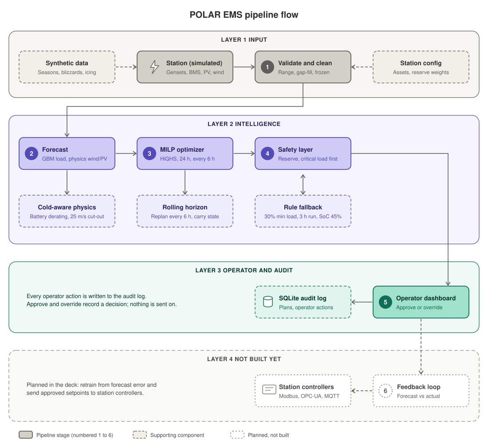
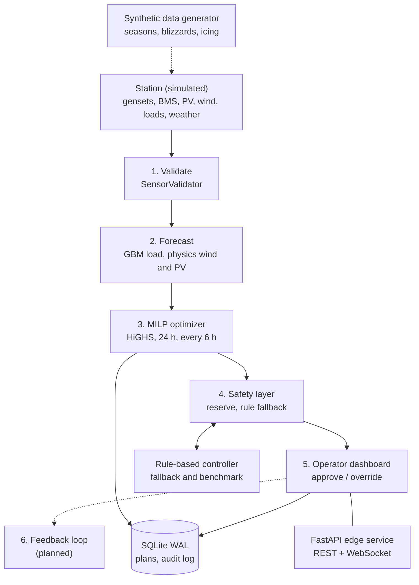

# Architecture: POLAR EMS (SIH26061)

## Pipeline

1. **Ingest and validate**: station telemetry, range checks, gap-fill, frozen-sensor check
2. **Forecast**: load (gradient boosting), wind and PV (weather through physics)
3. **Optimize**: 24 h MILP, replanned every 6 h
4. **Safety layer**: reserve, critical-load priority, rule-based fallback
5. **Operator**: approve or override, audit log
6. **Feedback loop**: forecast-versus-actual retraining (planned, not built)

Cross-cutting: synthetic data generator (feeds stage 1), edge-first design (everything runs on one on-site computer, offline).

## Flow

The same flow as editable Mermaid source:

| # | Stage | What happens | Main code |
| :-- | :-- | :-- | :-- |
| 1 | Validate | Range checks, last-value gap-fill, frozen anemometer check | `polar_ems/safety/sensor_validation.py` |
| 2 | Forecast | HistGradientBoosting for load; power curve and PV model for wind and PV | `polar_ems/forecasting/forecaster.py`, `polar_ems/simulation/microgrid.py` |
| 3 | Optimize | Mixed-integer dispatch over 24 h: gensets, battery, deferrable load | `polar_ems/optimizer/milp_solver.py` |
| 4 | Safety | Spinning reserve constraint inside the MILP; rule controller when no plan is active | `polar_ems/safety/fallback_controller.py` |
| 5 | Operator | Dashboard, approve and override endpoints, audit log | `static/`, `polar_ems/api/routes.py`, `polar_ems/storage/db.py` |
| 6 | Feedback | Not implemented | n/a |

## Scope boundary

Advisory management of a station microgrid: electrical dispatch only. Heat recovery and boiler fuel are not modelled. Nothing is sent to station controllers. Approve and override record a decision in the audit log. The operator makes the final call.

## Entity model

| Entity | Where | Notes |
| :-- | :-- | :-- |
| Station config | `polar_ems/config.py` | Gensets, battery, wind, PV, deferrable load, reserve weights |
| Dataset | `simulation/synthetic_data.py` | Hourly weather, load, flags for 30 days |
| Plan | `models/schemas.py`, `optimizer/milp_solver.py` | 24 steps of setpoints and KPIs |
| Telemetry record | `models/schemas.py` | Defined; not written by the API yet |
| Audit entry | `storage/db.py` | Operator actions |

## Runtime state (server)

Module-level globals in `polar_ems/api/routes.py`, created at import:

- Two 30-day datasets (summer, polar night). Current dataset is polar night.
- Load forecaster trained on the first 96 hours.
- `current_hour_index = 148`: a fixed "now" inside the dataset.
- Active plan, regenerated by `POST /api/scenarios/run`. Start state: SoC 0.68, genset 1 on with 4 h run, genset 2 off.

The server replays one fixed day. It does not advance time and does not ingest telemetry.

## Tech stack

| Layer | Repo today | Deck says |
| :-- | :-- | :-- |
| Forecasting | scikit-learn `HistGradientBoostingRegressor`, NumPy | LightGBM, PyTorch (planned) |
| Optimizer | `scipy.optimize.milp` (HiGHS) | SciPy/HiGHS built; Pyomo and OR-Tools planned |
| API | FastAPI, uvicorn, Pydantic, WebSocket | FastAPI plus asyncio edge service |
| Storage | SQLite, WAL mode | PostgreSQL + TimescaleDB planned, SQLite on edge |
| Frontend | Static HTML, CSS, vanilla JS, hand-built SVG charts | React + ECharts |
| Ingestion | None (labels only) | Modbus TCP, OPC-UA, MQTT planned |
| Packaging | `python start_edge_server.py` | Docker on industrial edge PC, Nginx planned |

## How the optimizer decides

1. **Inputs.** Forecast load, PV and wind for 24 h, ambient temperature, wind speed, start SoC, genset state.
2. **Objective.** Minimise diesel (linear curve per running genset), start cost, battery wear, curtailment, with a very large penalty on unserved energy.
3. **Hard limits.** Power balance every hour, 30% minimum genset load, 3 h minimum run, SoC 20-95%, reserve covering load, PV and wind-ramp risk, deferrable energy delivered.
4. **Cold.** Battery capacity and efficiency derate with temperature; wind output is zero at 25 m/s and above.
5. **Rolling.** Replan every 6 h; execute the first 6 steps; carry state forward.
6. **Fallback.** If there is no active plan, the rule controller sets the next hour.

Implementation details: [`milp_solver.py`](../polar_ems/optimizer/milp_solver.py), [`forecaster.py`](../polar_ems/forecasting/forecaster.py), [`microgrid.py`](../polar_ems/simulation/microgrid.py).

## Ethics and safety note

POLAR EMS supports operators of life-critical power. The design rule is: advisory first, operator approval, rule fallback on any fault, existing PLC protection stays in place. The current prototype enforces none of this on real hardware because it has no hardware interface.
